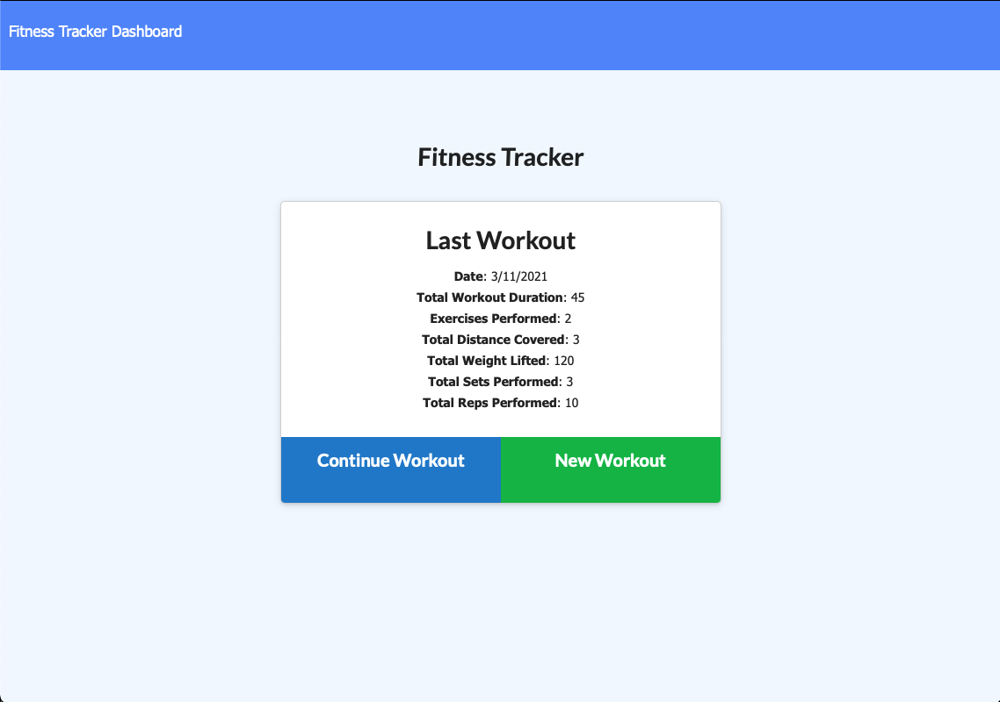
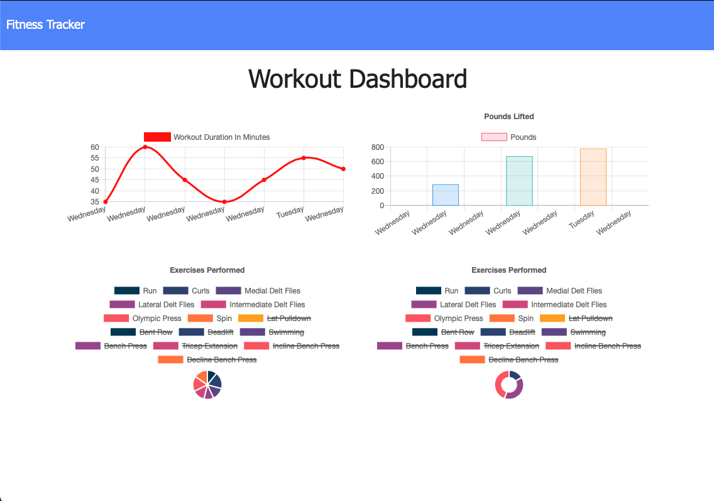
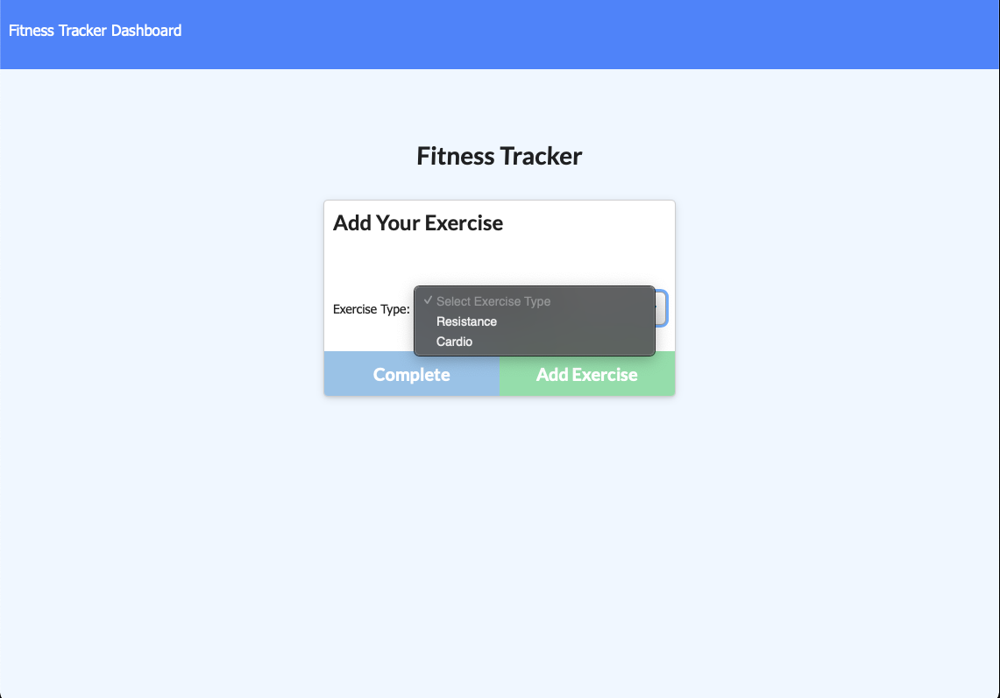

# Fitness Tracker

# Table of Contents

- [Author](##Author)
- [Project Description](##Description)
- [Install](##Install)
- [Usage](##Usage)
- [Testing](##Testing)
- [License](##License)
- [Contributors](##Contributors)
- [Questions](##Questions)

## Author

Name: Jack Murphy
GitHub: jmurphy0

## Description

This app is designed to keep track of your workouts (stored to mongoatlas) and allows your to view results of total duration and weight lifted.

## Install

View in browser

## Usage

Don't try to lift more than you can

## Testing

N/A

## License

License:   
 License link: https://opensource.org/licenses/MIT

## Contributors

N/A

## Questions

N/A

